<!-- ============ Bloom Header (day / night follows your theme) ============ -->

  <picture>
    <source media="(prefers-color-scheme: dark)" srcset="bloom-header-night.svg" />
    
  </picture>

<!-- ============ Sky ============ -->

  <picture>
    <source media="(prefers-color-scheme: dark)" srcset="sky-night.svg" />
    
  </picture>

<!-- ============ Tech Garden ============ -->

      
 
       
 
      
 
     
 
      

🌱 &nbsp;<b>Field guide</b> — open to read what every chip actually is

 

 
 
 
 
 

 

<!-- ============ Stats ============ -->

 

<!-- ============ Snake ============ -->

  

<!-- ============ Footer (a cat lives here) ============ -->

  <picture>
    <source media="(prefers-color-scheme: dark)" srcset="garden-footer-night.svg" />
    
  </picture>

