<!-- ============ Bloom Header ============ -->

  

 

<!-- ============ Tech Stack ============ -->

  

 

<!-- ============ Stats ============ -->

 

<!-- ============ Snake ============ -->

  

<!-- ============ Footer ============ -->

